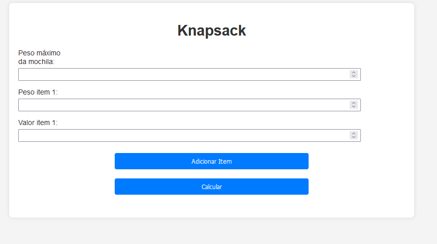
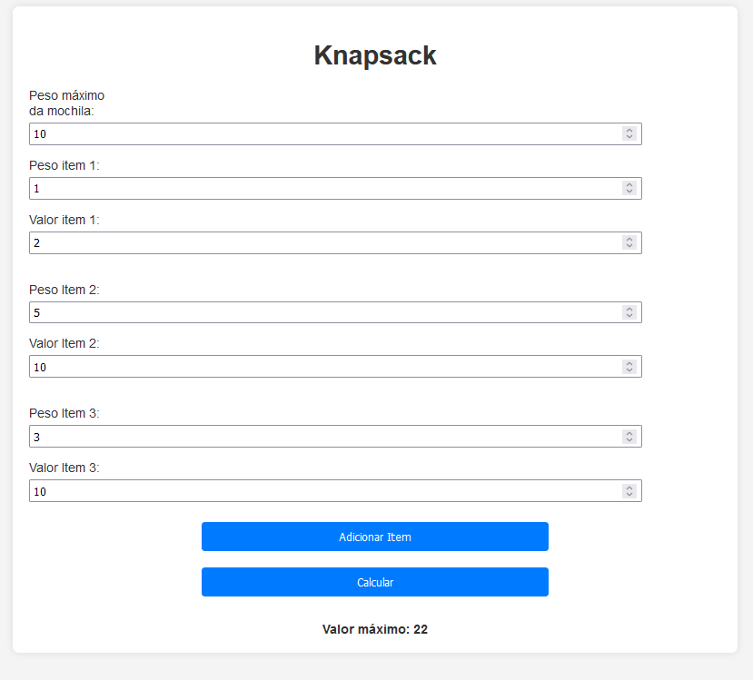

# Máximo Valor de Itens

**Conteúdo da Disciplina**: Programação Dinâmica 

## Alunos
|Matrícula | Aluno |
| -- | -- |
| 20/0061216  |  Cleber de Oliveira Brant |
| 20/0044559  |  Wesley Lira Carvalho |

## Sobre 
O objetivo desse projeto é colocar em prática o funcionamento do algoritmo Knapsack (Algoritmo da Mochila). Nele é possível observar os itens com os seus devidos valores e pesos, e também o peso máximo da mochila, que no qual no fim vai calcular a melhor combinação possível de itens em que seus valores serão o resultado ótimo do algoritmo.

## Screenshots
Menu no qual irá escolher os itens, seus valores e o seu peso além do peso da mochila.

Algoritmo retornando o melhor resultado possível.

## Instalação 
**Linguagem**: HTML, CSS e Javascript 

Com o projeto aberto, acesse o terminal e vá até onde o projeto está salvo. Após isso, digite o seguinte comando:

    npm install -g http-server

O comando acima permite que possa subir localmente o projeto em sua máquina. Após ter instalado o http-server, no mesmo terminal e na raiz do projeto insira o seguinte comando: http-server. Uma outra forma de subir localmente o projeto é instalando a extensão Live Server caso esteja pelo Visual Studio Code.

## Uso 
Após subir o projeto, adicione o valor do peso máximo da mochila e o valor e peso do item 1. Após isso, você pode clicar no botão "Calcular" ou então em "Adicionar Item" para adicionar mais itens na lista e no fim calcular para obter o melhor aproveitamento do Algoritmo da Mochila.

## Outros 
[Vídeo de Apresentação](https://www.youtube.com/watch?v=QMNDIxYqwWo)